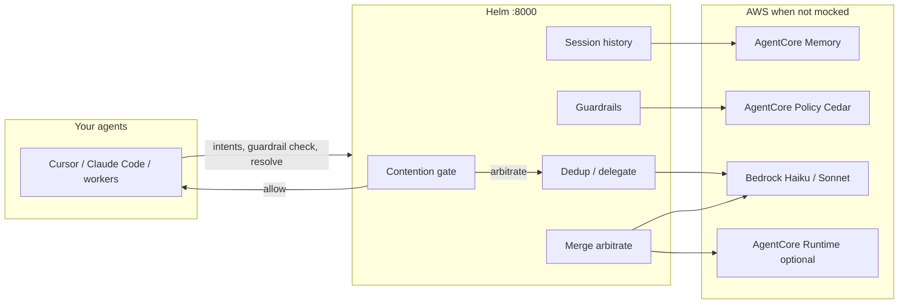

# Overlord — Build with Gratitude

**AWS Hackathon theme:** *Build with Gratitude* — not a generic “help people” app. Our parents spent careers in software engineering losing hours to merge conflicts, agents colliding on the same files, and compute burned on rework. **We built Overlord for them** — and for every engineer still grinding through the same chaos.

**Overlord** (coordination engine: **Helm**) sits between your agents and your repo. Every conflict it resolves is **time back in someone’s day**; every token the **Gratitude ledger** records is compute that did not get wasted. Amazon Bedrock runs **only when coordination actually matters** — contention gate, tiered Haiku/Sonnet, AgentCore Memory & Policy.

This repo is the **MergeAI** hackathon monorepo:

| Path | What it is |
|------|------------|
| [`helm/`](helm/) | **Helm API + Control Tower UI** — the thing to run for the demo |
| [`shopfix/`](shopfix/) | Etsy-lite sample app — real git sandboxes for benchmarks |
| [`streamcast/`](streamcast/) | Optional Twitch-style multi-agent demo |

---

## What you’ll see in 5 minutes (recommended)

**No AWS required** for the guided UI path—replay syncs into a live **Gratitude** ledger on your laptop.

### 1. Start services

```bash
# Terminal 1 — Helm API
cd helm
python3.11 -m venv .venv && source .venv/bin/activate
pip install -r requirements.txt
cp .env.example .env
export HELM_MOCK_BEDROCK=1 HELM_USE_LOCAL_MEMORY=true HELM_USE_LOCAL_POLICY=true HELM_GATE_ENABLED=1
cd backend && uvicorn main:app --reload --port 8000

# Terminal 2 — Control Tower
cd helm/frontend && npm install && npm run dev
```

### 2. Open presenter mode

**http://127.0.0.1:5173/?presenter=1**

1. **Begin presentation** (guided walkthrough).
2. **Control Tower** — watch replay: fleet dedup on `auth.py`, guardrail block, merge resolution.
3. Try scenario pills: **Fleet dedup** · **Merge conflict** · **Guardrail**.
4. **Incidents** — inspect duplicate-work and blocked-write stories.
5. **Gratitude** — the theme made visible: time and tokens returned (updates as replay syncs).
6. **Results** — benchmark charts and pillar headlines (contention gate, dedup, merge fleet, guardrails).

**Optional storefront:** run ShopFix on `:8001` and set `VITE_SHOPFIX_URL=http://127.0.0.1:8001` in `helm/frontend/.env` (see [ShopFix](#shopfix-optional)).

**On stage:** prefer replay + **Results** charts. Live Bedrock buttons are in **Developer Labs** only—use only if AWS is verified beforehand.

Full script: [`helm/docs/DEMO_JUDGES.md`](helm/docs/DEMO_JUDGES.md).

---

## The four pillars (measured on ShopFix + fleet harnesses)

| Pillar | What Helm does | Why it matters |
|--------|----------------|----------------|
| **Contention gate** | Skips expensive coordination when agents work on **disjoint files** | Same cost as baseline when there’s nothing to arbitrate |
| **Fleet dedup** | One Sonnet fleet call → continue one agent per overlap cluster, reassign the rest | **~18% cost / ~39% wall** at N=8 on real git contention (see Results) |
| **Merge fleet** | Parallel per-file merge-fix vs agent thrash | **~30% wall** on contested files at N=6 |
| **Guardrails** | Policy + Haiku/Sonnet before destructive writes | **~45% cost / ~55% wall** vs two full rebuilds on `auth.py` |

Charts and JSON provenance: [`helm/experiments/`](helm/experiments/) · live numbers in UI **Results** tab.

---

## Architecture (one screen)



**Two layers to remember:**

- **Contention gate** = *should we spend Bedrock on coordination?* (cheap, rule + overlap signals)
- **Guardrails** = *may this agent write this file?* (policy + optional LLM, always on proposed writes)

They compose; neither replaces the other.

---

## Tech stack

| Layer | Technology |
|-------|------------|
| API | **Python 3.11+**, **FastAPI**, Uvicorn |
| UI | **React 19**, **Vite**, TypeScript |
| Models | **Bedrock** — Haiku 4.5 for agents & light coordination, Sonnet 4.6 for fleet dedup / hard merges |
| Memory | **AgentCore Memory** (cloud) or local `.helm/session.json` |
| Policy | **AgentCore Policy** (Cedar) or local rule engine |
| Arbitration | `invoke_model` and/or **AgentCore Runtime** (`HELM_ARBITRATOR_ARN`) |
| Integrations | **MCP** server, Claude Code pre-write hook, GitHub issue delegation |
| Demo app | **ShopFix** — FastAPI + React, real git worktrees in benchmarks |

---

## Quick API tour

Base URL: **http://127.0.0.1:8000** · OpenAPI: **/docs**

| Endpoint | Purpose |
|----------|---------|
| `POST /intents` | Register what an agent plans to do; returns **contention** + optional alignment |
| `POST /guardrails/check` | Pre-write safety (production path) |
| `POST /guardrail/check` | Hackathon demo scenario (cache delete block) |
| `POST /resolve` / `POST /resolve/demo/{name}` | Merge / intent conflict arbitration |
| `GET /history?session_id=` | Session timeline |
| `GET /gratitude?session_id=` | Aggregated savings ledger |
| `GET /demo/smoke` | All three demo acts (mock-friendly) |
| `WS /ws/conflicts?session_id=` | Live dashboard stream |

**Session ID for demos:** `mergeai-hackathon-demo` (or set `VITE_HELM_TEAM_SESSION` in frontend `.env`).

---

## Live AWS (optional)

```bash
cd helm && cp .env.example .env
# aws login / SSO — no static keys in repo
export HELM_MOCK_BEDROCK=0 HELM_USE_LOCAL_MEMORY=false
python scripts/bootstrap_agentcore.py   # Memory + Policy
python scripts/verify_aws_setup.py --bedrock
cd backend && uvicorn main:app --port 8000
```

Playbook: [`helm/docs/AWS_SETUP.md`](helm/docs/AWS_SETUP.md).

**Multi-laptop demo:** one shared Helm on `:8000` (or ngrok), each machine sets `HELM_API_BASE` + same `HELM_TEAM_SESSION` — see Act A in [`helm/docs/DEMO_JUDGES.md`](helm/docs/DEMO_JUDGES.md).

---

## ShopFix (optional)

Runnable marketplace used for **authentic git** benchmarks:

```bash
cd shopfix/backend && python3.11 -m venv .venv && source .venv/bin/activate
pip install -r requirements.txt && python scripts/seed.py
uvicorn app.main:app --port 8001
```

Helm benchmarks (from `helm/`, API on `:8000`):

```bash
HELM_MOCK_BEDROCK=1 python scripts/run_shopfix_benchmark.py --mock
# Live USD (refuses mock unless --allow-mock):
HELM_MOCK_BEDROCK=0 python scripts/run_shopfix_live_benchmark.py --suite all --agents 4,6
```

---

## Tests & smoke

```bash
cd helm && source .venv/bin/activate
export HELM_MOCK_BEDROCK=1
pytest -q
curl -s http://127.0.0.1:8000/demo/smoke | python3 -m json.tool   # expect all_passed: true
cd frontend && npm test
```

---

## Repo map (where to dig deeper)

| Doc | Audience |
|-----|----------|
| [`helm/README.md`](helm/README.md) | Developers — endpoints, benchmarks, MCP |
| [`helm/AGENTS.md`](helm/AGENTS.md) | Teammates — gate vs guardrails, env vars |
| [`helm/docs/DEMO_JUDGES.md`](helm/docs/DEMO_JUDGES.md) | Presenter script — Acts A–C, multi-machine |
| [`helm/docs/STACK_FLOWCHART_SOURCE.md`](helm/docs/STACK_FLOWCHART_SOURCE.md) | Architecture for Claude / flowchart tools (nodes, edges, Mermaid) |
| [`helm/experiments/EXPERIMENT_RESULTS.md`](helm/experiments/EXPERIMENT_RESULTS.md) | Numbers, reproduce commands |
| [`helm/experiments/SHOPFIX_DEMO_PREP.md`](helm/experiments/SHOPFIX_DEMO_PREP.md) | Stage checklist |

---

## Hackathon theme — why judges should score Theme Alignment highly

| Rubric signal | How Overlord delivers |
|---------------|----------------------|
| Theme is **load-bearing** | Swap “gratitude” for “wellness” and the product breaks — the **Gratitude ledger** is the core UX payoff, not marketing copy. |
| **Concrete** who it serves | Software engineers (our parents’ generation) — merge conflicts, fleet overlap, guardrail blocks. |
| **Pays forward** | Session ledger + roadmap: fleet CI, shared memory, intent coordination for the next team. |
| **Bedrock track** | AgentCore Memory, Policy, tiered models, contention gate — architecture worse on a single REST chat endpoint. |

**Presenter line:** “This tab is our thank-you — every block and dedup is an hour someone gets back.”

Questions during judging? `?presenter=1` → guided demo → **Gratitude** after replay — that’s the theme on screen.
