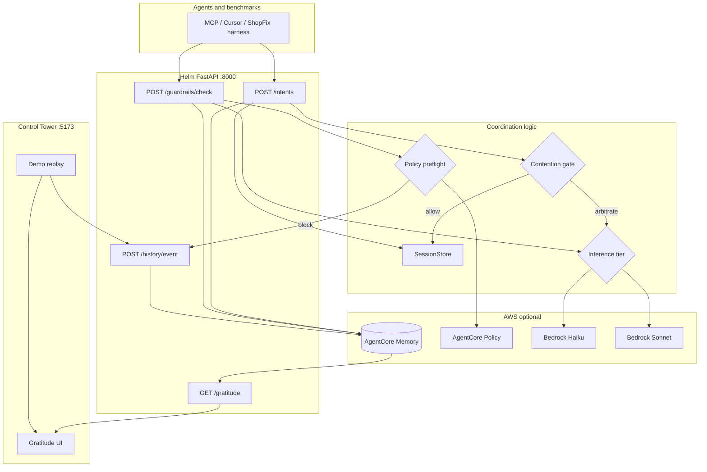

# Helm stack — flowchart source document

**Purpose:** Feed this file to Claude (or any diagram tool) to produce accurate flowcharts of the MergeAI / Helm system.  
**Repo:** `MergeAI` monorepo — primary app under `helm/`, demo app `shopfix/`, judge UI `helm/frontend/`.

---

## Instructions for the diagram generator

1. Prefer **swimlane** or **layered** diagrams: **Agents** → **Helm API** → **Coordination logic** → **AWS**.
2. Use **diamond** nodes for decisions; label edges with **Yes/No** or tier names (`allow`, `arbitrate`, `allowed`, `blocked`).
3. Draw **two separate paths** for **Contention gate** (coordination cost) vs **Guardrails** (write safety) — they are not the same feature.
4. Show **local fallback**: AgentCore Memory writes can fall back to `.helm/session.json` if cloud fails.
5. Judge demo path uses **mock Bedrock** + **frontend replay** syncing to real `POST /history/event` — not live agent loops.
6. Optional third diagram: **ShopFix benchmark** (real git sandboxes calling Helm API).

Suggested outputs: (A) end-to-end system context, (B) `POST /intents` flow, (C) `POST /guardrails/check` flow, (D) judge UI replay → Gratitude.

---

## System context (one paragraph)

Coding agents (Cursor, Claude Code, MCP clients, benchmark harnesses) call **Helm FastAPI** on port **8000**. Helm maintains **session state** in memory (`SessionStore`) and **durable events** via **AgentCore Memory** (or local JSON). Before expensive **Amazon Bedrock** calls, the **contention gate** decides whether coordination is needed. **Guardrails** run Cedar-style **AgentCore Policy** preflight on every proposed write, then optional **Haiku/Sonnet** arbitration. Results feed **history**, **WebSocket** broadcasts, and the **Gratitude ledger**. The **Control Tower** (React/Vite on **5173**) replays scripted ShopFix scenarios and syncs events into the ledger for judges.

---

## Swimlanes (actors)

| Lane ID | Name | Technology | Port / path |
|---------|------|------------|-------------|
| `AGENT` | Coding agents & benchmarks | MCP, curl, ShopFix harness | calls `:8000` |
| `UI` | Control Tower | React 19, Vite, TypeScript | `:5173` |
| `API` | Helm backend | FastAPI, Uvicorn | `helm/backend` `:8000` |
| `STORE` | In-process stores | `SessionStore`, `ConflictStore`, `MissionStore` | RAM |
| `MEM` | Session history | AgentCore Memory **or** `.helm/session.json` | `agentcore_memory.py` |
| `GATE` | Contention gate | Python rules + overlap | `contention_gate.py` |
| `POL` | Policy preflight | AgentCore Policy **or** local Cedar bridge | `agentcore_policy.py` |
| `ROUTER` | Model tier picker | Complexity score → Haiku / Sonnet | `inference_routing.py` |
| `BR` | Amazon Bedrock | Claude Haiku 4.5, Sonnet 4.6 | `invoke_model` |
| `RT` | AgentCore Runtime | Optional merge arbitrator | `HELM_ARBITRATOR_ARN` |
| `SHOP` | ShopFix app | FastAPI demo marketplace | `shopfix/` `:8001` |

---

## Node inventory (use these IDs in diagrams)

### External

| ID | Label | Lane |
|----|-------|------|
| `N_AGENT` | Agent / IDE / MCP client | AGENT |
| `N_UI` | Browser Control Tower | UI |
| `N_SHOP` | ShopFix storefront (optional) | SHOP |

### Helm API entrypoints

| ID | Label | HTTP | File |
|----|-------|------|------|
| `N_INTENTS` | POST /intents | POST | `routes/intents.py` |
| `N_GUARD` | POST /guardrails/check | POST | `routes/guardrails.py` |
| `N_GUARD_DEMO` | POST /guardrail/check | POST | `routes/guardrail_demo.py` |
| `N_RESOLVE` | POST /resolve | POST | `routes/resolve.py` |
| `N_GIT_MERGE` | POST /merge-conflict | POST | `routes/git_resolve.py` |
| `N_MISSIONS` | POST /missions/delegate | POST | `routes/missions.py` |
| `N_HIST_GET` | GET /history | GET | `routes/history.py` |
| `N_HIST_POST` | POST /history/event | POST | `routes/history.py` |
| `N_GRAT` | GET /gratitude | GET | `routes/gratitude.py` |
| `N_WS` | WS /ws/conflicts | WS | `ws/hub.py` |
| `N_SMOKE` | GET /demo/smoke | GET | `routes/demo_smoke.py` |

### Internal services

| ID | Label | File |
|----|-------|------|
| `N_SESSION` | SessionStore (intents per file) | `store/sessions.py` |
| `N_ALIGN` | maybe_align_on_declare | `services/intent_alignment.py` |
| `N_DELEGATE` | Mission delegation / fleet dedup | `services/delegation.py` |
| `N_GRAT_SVC` | build_gratitude_ledger | `services/gratitude_ledger.py` |
| `N_KB` | knowledge_base adapter | `bedrock/knowledge_base.py` |
| `N_CHECK` | check_action (guardrails) | `bedrock/guardrails.py` |
| `N_PREFLIGHT` | preflight_check (policy) | `bedrock/guardrails.py` |
| `N_GATE_INTENT` | assess_intent | `bedrock/contention_gate.py` |
| `N_GATE_DEDUP` | assess_dedup | `bedrock/contention_gate.py` |
| `N_TIER` | select_inference_tier | `bedrock/inference_routing.py` |
| `N_MEM_W` | log_action / log_intent / log_decision | `bedrock/agentcore_memory.py` |
| `N_MEM_R` | list_events | `bedrock/agentcore_memory.py` |

### Frontend (judge path)

| ID | Label | File |
|----|-------|------|
| `N_LANDING` | Landing ?presenter=1 | `components/LandingPage.tsx` |
| `N_REPLAY` | useDemoReplay (scripted timeline) | `hooks/useDemoReplay.ts` |
| `N_SYNC` | syncReplayToLedger | `orchestration/syncReplayToLedger.ts` |
| `N_TOWER` | Control Tower view | `components/ControlTower.tsx` |
| `N_GRAT_UI` | Gratitude panel | `GratitudeLedger.tsx` |
| `N_RESULTS` | Results / charts | `components/BenchmarkProof.tsx` |

### AWS (attach as icons or subprocess nodes)

| ID | Label | Used for |
|----|-------|----------|
| `AWS_MEM` | Bedrock AgentCore Memory | Session event log |
| `AWS_POL` | Bedrock AgentCore Policy | Cedar preflight on writes |
| `AWS_HAIKU` | Bedrock Claude Haiku 4.5 | Agents, light guardrail/dedup |
| `AWS_SONNET` | Bedrock Claude Sonnet 4.6 | Fleet dedup, hard merges |
| `AWS_RT` | AgentCore Runtime | Optional `/resolve` path |

---

## Edge list — system context (high level)

Format: `FROM -> TO : label [condition]`

```
N_AGENT -> N_INTENTS : declare work
N_AGENT -> N_GUARD : before write
N_AGENT -> N_RESOLVE : merge conflict
N_AGENT -> N_GIT_MERGE : git file conflict

N_UI -> N_LANDING : open app
N_LANDING -> N_REPLAY : Begin presentation
N_REPLAY -> N_TOWER : shows timeline
N_REPLAY -> N_SYNC : each replay milestone
N_SYNC -> N_HIST_POST : POST /history/event
N_HIST_POST -> N_KB -> N_MEM_W : persist event
N_GRAT_UI -> N_GRAT : GET ledger
N_GRAT -> N_KB -> N_MEM_R : read history
N_GRAT -> N_GRAT_SVC : aggregate metrics

N_INTENTS -> N_SESSION : record intent
N_INTENTS -> N_KB : intent_declared event
N_INTENTS -> N_ALIGN : background alignment
N_INTENTS -> N_WS : broadcast

N_GUARD -> N_CHECK : full guardrail pipeline
N_GUARD -> N_KB : if blocked
N_GUARD -> N_WS : if blocked

N_KB -> N_MEM_W : write [cloud or local fallback]
N_MEM_R -> N_KB : read [cloud or local fallback]
```

---

## Flow B — POST /intents (coordination + contention gate)

```
START (agent declares intent on file_path)

N_INTENTS
  -> N_SESSION : record_intent(session, agent, file, text)
  -> N_KB : append intent_declared
  -> N_ALIGN : maybe_align_on_declare

N_ALIGN
  -> N_GATE_INTENT : assess_intent [if HELM_GATE_ENABLED]

DECISION G1: gate_tier == "allow" AND no peers on file?
  YES -> RETURN { overlap: false, contention: allow }  [skip Bedrock align]
  NO -> continue

DECISION G2: other agents on same file?
  NO -> RETURN { overlap: false, contention: ... }
  YES -> overlap path

N_TIER : select_inference_tier(operation=intent)
DECISION G3: HELM_MOCK_BEDROCK == 1?
  YES -> resolve_intent_conflict (simulator, no AWS)
  NO -> AWS_HAIKU or AWS_SONNET via align_intents_tracked

align success
  -> N_KB : append intent_aligned
  -> RETURN { overlap_detected: true, alignment: {...}, contention: {...} }
```

**Key message for diagram:** Gate **allow** = skip expensive alignment Bedrock when no real contention.

---

## Flow C — POST /guardrails/check (write safety)

```
START (agent proposes write/delete on file_path)

N_GUARD -> N_CHECK : check_action(...)

N_CHECK -> N_PREFLIGHT : evaluate via AWS_POL or local policy

DECISION P1: preflight allowed?
  NO -> block (rule name on edge)
  YES -> continue

N_CHECK : load peers from N_SESSION / N_MEM (agents_on_file)

DECISION P2: conflict with peer intent or ownership?
  NO -> RETURN allowed=true
  YES -> arbitration path

N_TIER : select_inference_tier(operation=guardrail)
DECISION P3: tier?
  haiku -> AWS_HAIKU
  sonnet -> AWS_SONNET

arbitration result
  DECISION P4: allowed?
    NO -> N_KB guardrail_blocked + optional gratitude_handoff
         -> N_WS broadcast
         -> RETURN allowed=false, handoff={...}
    YES -> N_KB log allowed action
         -> RETURN allowed=true
```

**Key message:** Guardrails always run on writes; gate does **not** replace them.

---

## Flow D — Fleet dedup (benchmark / POST missions delegate)

```
START (N agents declare overlapping work on same file cluster)

N_MISSIONS or benchmark harness
  -> N_GATE_DEDUP : assess_dedup(session, agents by file)

DECISION D1: gate_tier == "allow"?  [disjoint files / no cluster]
  YES -> skip Sonnet dedup (0 coordination Bedrock calls)
  NO -> arbitrate path

N_DELEGATE : detect_duplication / fleet plan
  -> AWS_SONNET : one fleet dedup call (typical)
  -> reassign non-primary agents (smaller Haiku patches)
  -> N_KB : mission_delegated { duplicate_detected, assignments }
  -> N_GRAT_SVC : counts Deduped, Yielded, Tokens
```

---

## Flow E — Merge resolution

```
PATH 1 — Demo / API
  N_RESOLVE or N_GIT_MERGE
    -> DECISION: HELM_ARBITRATOR_ARN set?
         YES -> AWS_RT (AgentCore Runtime)
         NO -> AWS_SONNET invoke_model
    -> N_KB : conflict_resolved
    -> N_WS

PATH 2 — Merge fleet benchmark
  Multiple agents, contested files
    -> parallel per-file Haiku merge-fix (default MERGE_FLEET_STRATEGY=haiku_chain)
    -> optional escalate to AWS_SONNET
```

---

## Flow F — Judge UI replay → Gratitude (no live agents)

```
N_UI opens ?presenter=1
N_LANDING --Begin presentation--> N_REPLAY (advancing=true, syncToLedger=true)

loop each scripted TimelineEvent in shopfixDemoReplay / demoScenarios
  N_REPLAY updates N_TOWER timeline + incidents
  N_SYNC maps event.kind:
    duplicate_detected -> POST mission_delegated
    guardrail_blocked -> POST guardrail_blocked
    merge_resolved -> POST conflict_resolved
    benchmark_checkpoint -> POST benchmark_checkpoint
  N_HIST_POST -> N_KB -> N_MEM_W

replay complete
  N_GRAT_UI listens helm-ledger-updated
  N_GRAT_UI -> N_GRAT -> displays Blocked, Deduped, Tokens

parallel: N_RESULTS reads static charts + DEMO_PILLARS from experiments/
```

---

## Decision reference table

| Decision | Location | Outcomes | Effect |
|----------|----------|----------|--------|
| Contention gate tier | `contention_gate.py` | `allow`, `triage`, `arbitrate` | Skip or run Bedrock coordination |
| Gate enabled | `HELM_GATE_ENABLED` | on/off | Master switch |
| Mock Bedrock | `HELM_MOCK_BEDROCK` | 1/0 | Simulator vs real AWS |
| Local memory | `HELM_USE_LOCAL_MEMORY` | true/false | JSON file vs AgentCore Memory |
| Local policy | `HELM_USE_LOCAL_POLICY` | true/false | Local Cedar bridge vs cloud Policy |
| Inference tier | `inference_routing.py` | `haiku`, `sonnet` | Model selection by complexity |
| Guardrail preflight | `agentcore_policy.py` | allow/block | Before any LLM |
| Write allowed | `guardrails.check_action` | true/false | Agent may proceed |

---

## AWS service → Helm feature mapping

| AWS service | Helm feature | Code touchpoints |
|-------------|--------------|------------------|
| **Bedrock Haiku 4.5** | ShopFix agent edits, simple guardrails, merge fleet default | `agents/haiku_agent.py`, `MERGE_FLEET_STRATEGY=haiku_chain` |
| **Bedrock Sonnet 4.6** | Fleet dedup, hard guardrails, merge escalation | `helm.py`, `dedup_harness.py`, `HELM_BEDROCK_MODEL_ID` |
| **AgentCore Memory** | Shared session history, multi-laptop demos | `agentcore_memory.py`, `knowledge_base.py` |
| **AgentCore Policy** | Write preflight (overlap, intent clash) | `agentcore_policy.py`, `guardrails.preflight_check` |
| **AgentCore Runtime** | Packaged merge arbitrator | `arbitration/runner.py`, `HELM_ARBITRATOR_ARN` |
| *Not used in judge UI* | Bedrock Knowledge Base RAG, Bedrock Guardrails content filters | legacy env only |

---

## Environment switches (annotate on diagram legend)

| Variable | Demo default | Live bench |
|----------|--------------|------------|
| `HELM_MOCK_BEDROCK` | `1` | `0` |
| `HELM_USE_LOCAL_MEMORY` | `true` | `false` + `AGENTCORE_MEMORY_ID` |
| `HELM_USE_LOCAL_POLICY` | `true` | `false` |
| `HELM_GATE_ENABLED` | `1` | `1` |
| `HELM_TEAM_SESSION` | `mergeai-hackathon-demo` | same |

---

## Suggested Mermaid (starter — refine as needed)



---

## File map (for diagram footnotes)

```
helm/
  backend/main.py              # FastAPI app, router wiring
  backend/bedrock/
    contention_gate.py         # Gate: allow / arbitrate
    guardrails.py              # Preflight + LLM arbitration
    agentcore_memory.py        # Memory read/write + local fallback
    agentcore_policy.py        # Cedar policy bridge
    knowledge_base.py          # Events ↔ gratitude types
    inference_routing.py       # Haiku vs Sonnet
  backend/services/
    intent_alignment.py        # /intents orchestration
    delegation.py              # Fleet dedup
    gratitude_ledger.py        # GET /gratitude aggregation
  frontend/src/
    hooks/useDemoReplay.ts     # Judge timeline
    orchestration/syncReplayToLedger.ts
    components/ControlTower.tsx
    GratitudeLedger.tsx
shopfix/                         # Real git benchmark fixture
```

---

## Four pillars (for a results / proof slide flowchart)

| Pillar | Trigger | Helm action | AWS involved |
|--------|---------|-------------|--------------|
| Contention gate | Disjoint agents/files | `gate_tier: allow` — skip dedup Bedrock | None (rules only) |
| Fleet dedup | Overlap on same file | Sonnet fleet plan + reassign | Sonnet (+ Haiku patches) |
| Merge fleet | Git merge conflicts | Parallel per-file merge-fix | Haiku (optional Sonnet) |
| Guardrails | Risky proposed write | Policy block + optional LLM | Policy + Haiku/Sonnet |

Numbers for slides: see `frontend/src/demoHeadlines.ts` and `experiments/EXPERIMENT_RESULTS.md`.

---

*End of flowchart source. When generating diagrams, preserve lane separation between Contention gate and Guardrails.*
